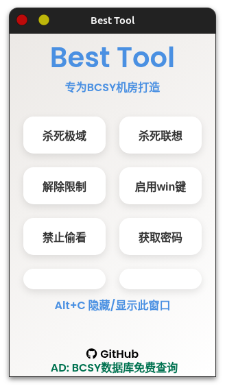

# Best Tool

 - 拔萃实验机房最好的工具箱
 - 使用 nodejs + electron 编写
 - Alt + C 可以隐藏/显示程序窗口
---

### 软件截图:



---

| 功能               | 支持情况 |
| ------------------ | -------- |
| 结束极域      | ✔        |
| 杀死联想      | ✔        |
| 解除网络/文件限制  | ✔        |
| 启用win键          | ✔        |
| 反截屏(打游戏专用) | ✔        |
| 获取BCSY的常用密码 | ✔        |
<!-- | 崩溃教师端极域     | ✘        | -->

---

### 运行项目
1. 确保你有 nodejs 环境
2. 安装 electron 框架
```bash
npm install electron --save-dev
``` 
3. 运行
```bash
npm run start
```

<div align="center">
  <a href="https://github.com/yajiyi/best_tool/blob/main/LICENSE"></a>
  <a href="https://github.com/yajiyi/best_tool/actions?query=workflow%3ABuild"></a>
  <a href="https://github.com/yajiyi/best_tool/releases"></a>

  <a href="https://github.com/yajiyi/best_tool/discussions"></a>
  <a href="https://github.com/yajiyi/best_tool/releases"></a>
</div>